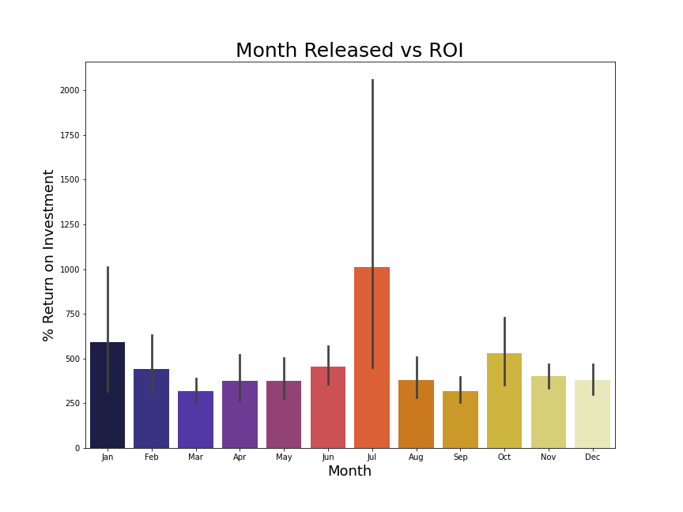
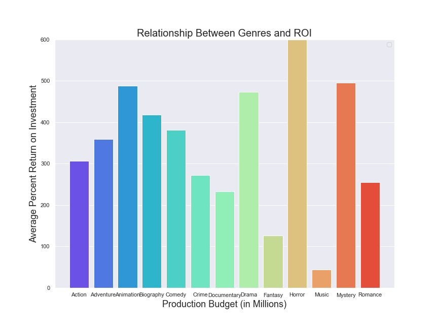
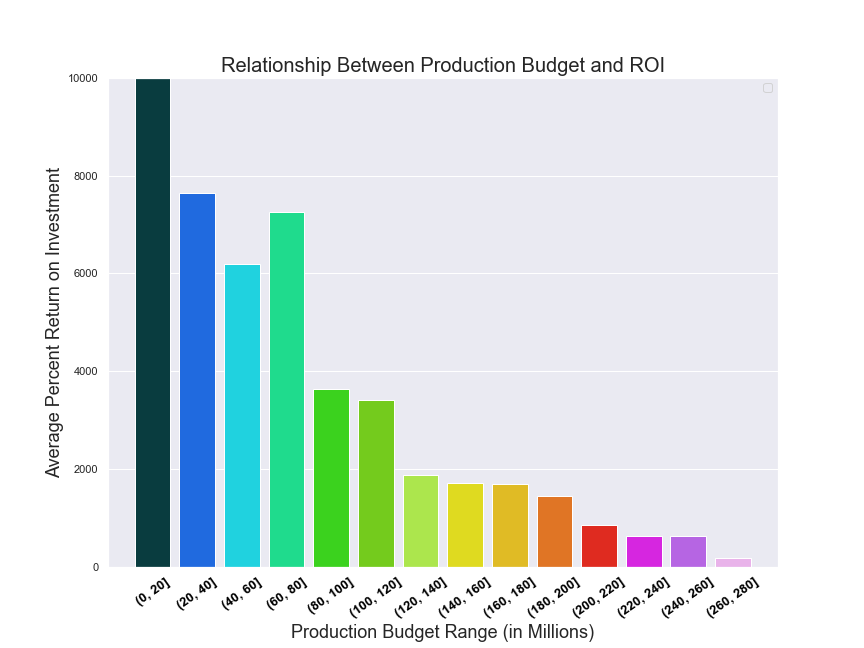

# Movie Project Description

Analyzing movie data to provide sound business recommendations for Microsoft's new film industry venture.

## Data

The data used comes from 3 different sources:

- IMDb
- Rotten Tomatoes
- Box Office Mojo

#### This data is found in the zippedData folder

## Key Findings

### Is there a specific month/season movies should be released?

To answer this question, I looked at whether or not there was a correlation between the months movies were released and how how of an ROI (return on investment) they had on average.  This data came from a combination of the **bom.movie_gross.csv.gz** and **tn.movie_budgets.csv.gz** files.  We then cleaned the data, and removed any missing values we still had.  Then we converted the data types of the month column to integers as well as the currency columns to floats in order to further work with the information.

Our key findings were:

1. The best time to release a movie is July based on the average ROI of movies released during that month.
2. Another optimal time would be nearest holiday seasons.

#### Recommendations

1. If you're looking to optimize your potential earnings, releasing a movie in July is your best bet in doing so.
2. If you're looking for less competition between other movies in the market, releasing a movie in a 'dead' period could gain you additional popularity if you aren't looking to have a budget to compete with a summer blockbuster.

### Which genres of movies are the best to create?

In order to answer this, we had to split up the genres listed for each movie.  Since it's sorted alphabetically its somewhat skewed however we converted the dictionary of genres (if multiple existed) into separate genre columns in order to isolate each one.  We used our previous dataset created and appended new genre1 and genre2 columns. 

Our key findings were:

1. The highest ROI movie genres were Animation, Drama, and Mystery.
2. The lowest ROI movie genres were Music and Fantasy.

#### Recommendations

1. We recommend that you start creating Animation, Drama, and Mystery movies, and as you can see Horror also did extremely well however, this data was skewed by a significant outlier.  It is also important to note that the genres (such as horror), did better in certain months according to holidays/seasons.
2. The lowest ROI movie genres seem to be ones with niche audiences and therefore don't provide a good amount of base viewership.

### Is there a relationship between the production budget and the ROI for films?

To answer this, we had to look at the currency columns of our data which were previously converted to floats.  We plotted the values to a scatterplot in order to examine the relationship and see if we noticed any patterns within the data.

Our key findings were:
1. There is an obvious relationship between the level of production budget the film had, and its ROI.
2. As the production budget rose, the average ROI fell.

#### Recommendations|

1. If you are looking to maximize your ROI for an individual movie, using a smaller production budget is what we would encourage as there is a clear exponential decay relationship that flattens out between production budget and ROI.

## Conclusion

After analyzing all the movie data we acquired our recommendations to Microsoft for their movie venture would be to:

1. Use a smaller budget, especially to start.
2. Release movies over the summer (specifically July) or winter (specifically January). 
3. Don’t make Musicals, Fantasies, or Documentaries, and aim to create shorter movies (which has a correlation between a smaller production budget).

#### Future Work

In future analysis, we are interested to see if there is a relationship between:
1. The specific actors/directors in each movie, and the ROI.
2. The level of marketing, and the relationship between marketing costs and ROI.  (Interesting to see if it is similiar to production budget in that it has an expontentially decaying relationship.)

